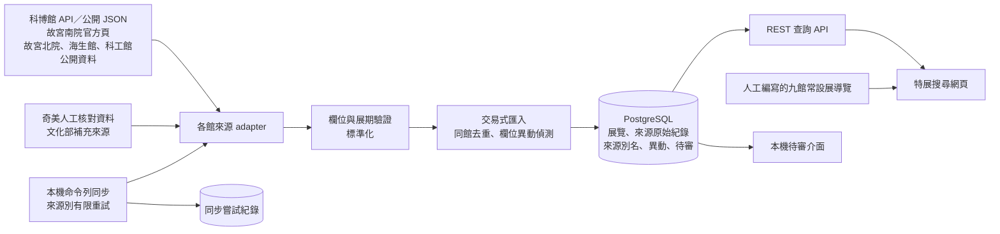
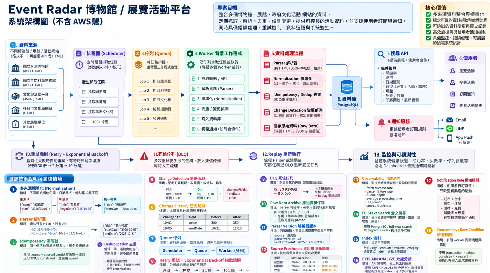

# Event Radar 架構：目前實作與目標方向

最後核對：2026-10-10。這份文件供作品展示與開發取捨使用。**下方第一張圖是已實作的本機架構；第二張是未來構想，不代表現有服務或已上線能力。** 產品目前聚焦臺灣博物館的特展與期間限定展，一般市集、音樂節與講座不自動混入搜尋。

## 目前實作（本機 MVP）

`src/sync-source.ts` 可對五個來源各自執行同步，暫時性錯誤最多嘗試三次，重試間隔為 30 秒、2 分鐘；`sync_attempts` 留下結果。奇美文化部補充資料尚未納入這五個自動同步工作。資料無法確認展期或官方連結時進入待審，不進入公開搜尋。匯入有交易回滾、同館跨來源保守去重與欄位異動紀錄。

網站由 `src/server.ts` 提供靜態頁面與 `/museums`、`/exhibitions`、`/exhibitions/:id/changes`、`/visit-status` 等 API。可依城市、館所、日期、展覽狀態及**明確標示免費**的資料查詢；關鍵字目前使用 `ILIKE`。九館常設展頁是人工編寫的靜態導覽，不是自動同步的展件清單。

GitHub Actions 的 CI 已執行型別、單元與 PostgreSQL 整合測試。每日同步 workflow 雖已寫好，仍受 `EVENT_RADAR_SYNC_ENABLED` 關閉；沒有遠端資料庫、公開網站或線上每日更新。詳見[目前進度](../STATUS.md)與[運作設計](operations.md)。

## 目標架構（概念圖，尚未實作）

這張長期概念圖保留原稿，圖內「系統架構圖」與「100+ 來源」等文字是**願景**，不是已完成聲明。部分流程與數字需要在實作前重新設計與驗證：

| 概念圖區塊 | 現況與展示方式 |
| --- | --- |
| Scheduler | 有本機命令列同步與未啟用的每日 workflow；沒有已運作的線上排程。 |
| Queue、Worker 並行、DLQ、Replay | 尚未建立持久化工作佇列或背景工作服務。 |
| Retry | 只有來源別程序重試，最多三次；沒有圖上的第三段 10 分鐘退避。 |
| 原始資料與異動歷史 | 已保存來源原始紀錄與欄位變更；沒有完整 HTML 檔案庫或任意版本重播。 |
| 搜尋與索引 | 有日期索引及查詢 API；目前關鍵字為 `ILIKE`，不是已啟用的全文搜尋。現有資料量尚不足以證明新增複合索引有收益。 |
| 通知、訂閱、Email／LINE／Push | 尚未實作。 |
| Observability Dashboard | 有同步嘗試紀錄與本機狀態查詢；沒有主動告警或監控儀表板。 |
| 來源規模 | 五個來源有各自同步程式，奇美另有人工／補充來源；不是 100 多個正式來源。 |

## 接下來的工程順序

1. **先提高來源可靠性。** 特別釐清奇美正式資料取得方式與涵蓋率，保留官方連結、驗證日期與待審證據；不以抓取成功等同資料正確。
2. **讓已完成的同步真正可運作。** 準備可從 GitHub Actions 連線的資料庫與 Secret，手動執行每個來源，核對成功時間、失敗隔離及資料新鮮度，再決定是否開啟每日排程與公開網站。
3. **以故障情境決定 Queue。** 當來源工作量、重試或人工重播需求證明現有獨立工作不足時，先定義 job 狀態、冪等鍵與失敗恢復，再比較 PostgreSQL 工作表和 Redis/BullMQ。DLQ、通知與監控在此之後按需求加入。

每完成一階段，都應更新這份文件的現況、測試證據與概念圖標示，避免把設計目標誤寫成工作經驗。
